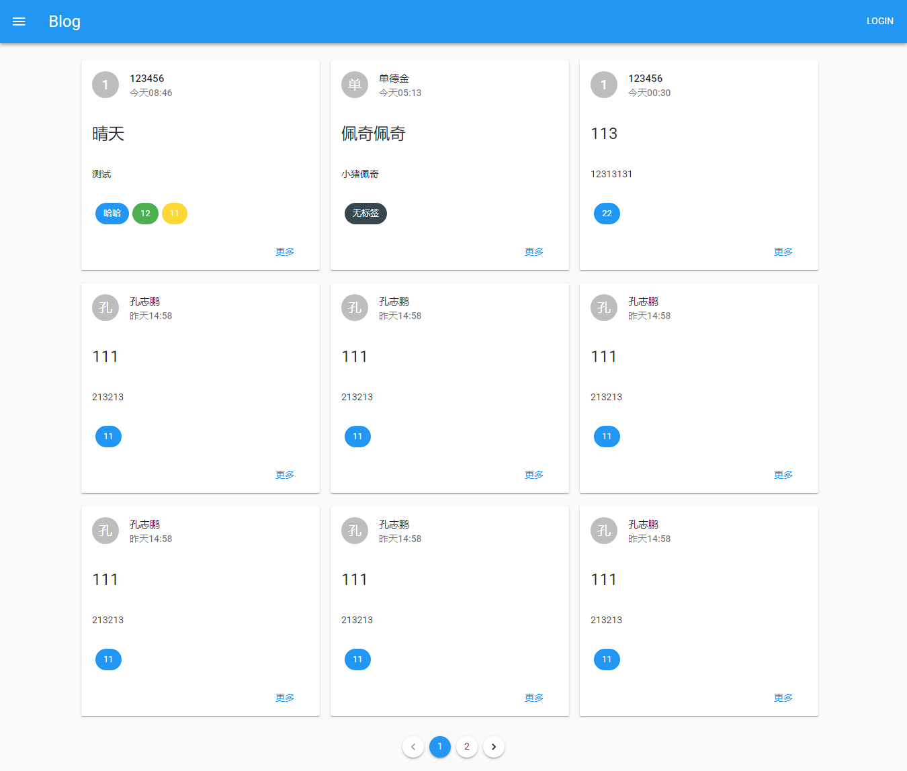
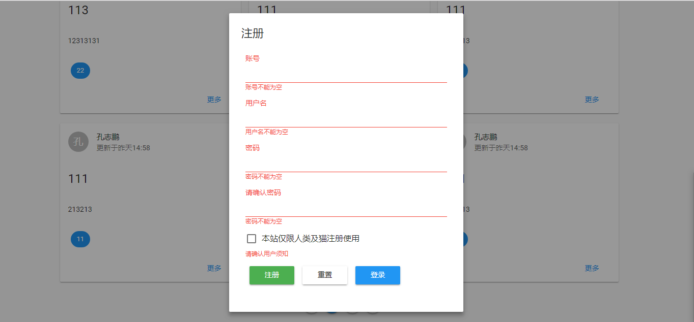
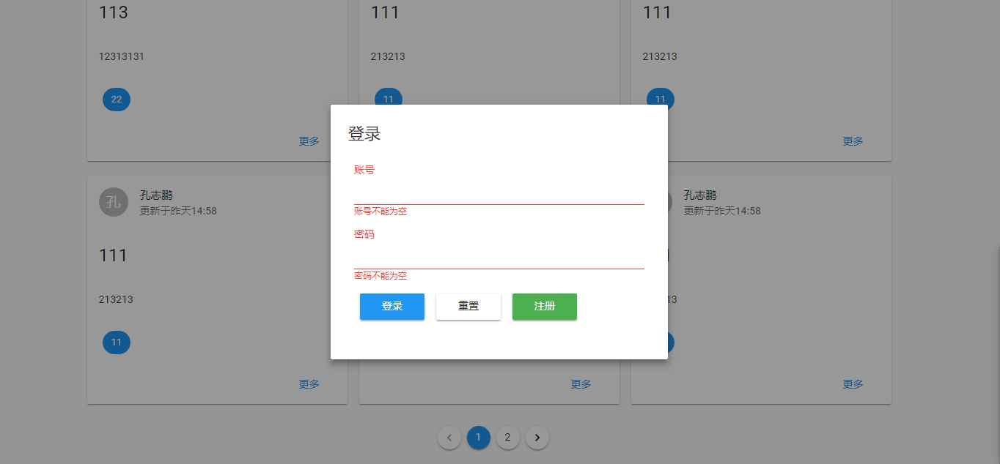
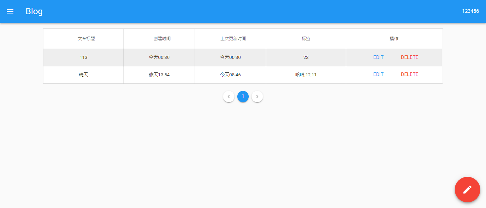
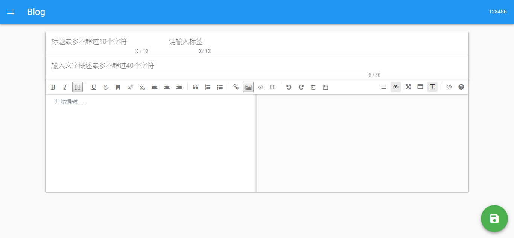

# blog前端部分

[](https://cn.vuejs.org)

> A Vue.js and Node.js project

## 如何在自己本地上运行该项目前端部分

1. 克隆本项目前端

```bash
git clone git@github.com:KongValley/blog-front-end.git
```

2. 安装依赖

``` bash
npm install
```

3. 运行

```bash
npm run dev
```

4. 打开浏览器访问`localhost:8080`


## 使用的UI

[Muse-UI](https://muse-ui.org/#/zh-CN)基于 Vue 2.0 优雅的 Material Design UI 组件库


<<<<<<< HEAD
=======
## 部分页面图










>>>>>>> 添加预览图
